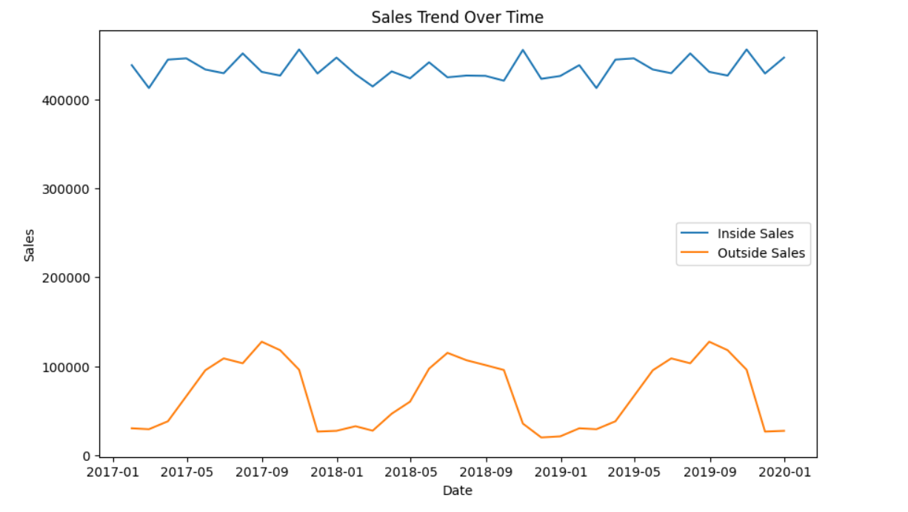
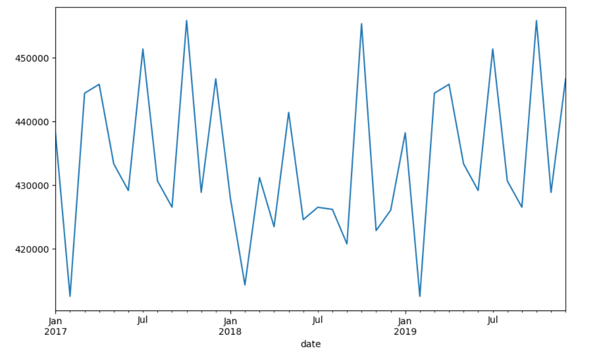

# Restaurant Sales Forecasting Project

## Introduction
This project aims to forecast the sales of a restaurant using various machine learning techniques. The dataset used in this project contains everyday sales data from 2017 to 2019. In addition to this, weather data for the city where the restaurant is located was also incorporated.

## Data Visualization
The project started with visualizing the inside and outside sales graph.
Which means the sales that took place inside the restaurant and outside the restaurant like small snacks items and sweets.

## Time Series Visualization
The time series visualization section details the process of using ARIMA and SARIMA models to predict sales. The models were trained on the 2017 and 2018 data, and the aim was to predict sales for 2019. The predicted sales and actual sales were then plotted for both models.
### Sales Graph
In this section, a graph was plotted to visualize the overall monthly sales
.

### ARIMA

<table>
  <tr>
    <td>
      <figure>
        
        <figcaption>Sales in Q1 2021</figcaption>
      </figure>
    </td>
    <td>
      <figure>
        
        <figcaption>Sales in Q2 2021</figcaption>
      </figure>
    </td>
  </tr>
</table>

### SARIMA

## Neural Networks
In the next step, a neural network was built to forecast sales. The model was first trained on everyday sales, and then on monthly sales by aggregating the data.

## Multivariate Time Series Analysis
To improve the accuracy of the forecast, the weather data was merged with the sales data. Various machine learning models were then used to predict sales. Linear Regression, Decision Tree Regression, Random Forest Regression, SVR, Gradient Boosting Regression, and Lasso Regression models were all tested. However, the results were not satisfactory.

## Data Preprocessing
The data preprocessing section describes how the sales and weather data was merged.

## Machine Learning Models
This section describes the various machine learning models that were used for multivariate time series analysis, and the results obtained.

### Feature Importance
This section details the process of selecting only the important features for the final model.

## Stacked Classifier Model
Finally, a  using only the important featuresa a model was built using a stacked classifier with Decision Tree Regression, Random Forest Regression, and Gradient Boosting Regression. This model produced a low MSE score, indicating its success in predicting sales.

## Conclusion
This project demonstrates the use of various machine learning techniques to forecast restaurant sales. The models used in this project could be extended and adapted to improve sales forecasts for other restaurants as well.

The code and documentation for this project can be found in the Github repository.
