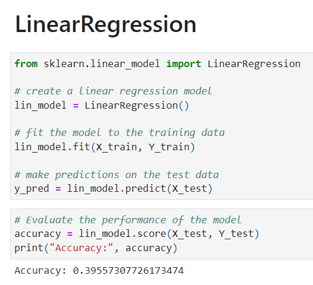
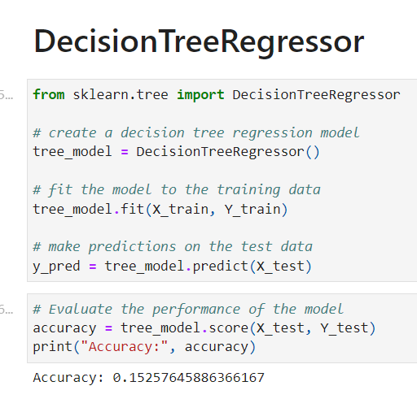
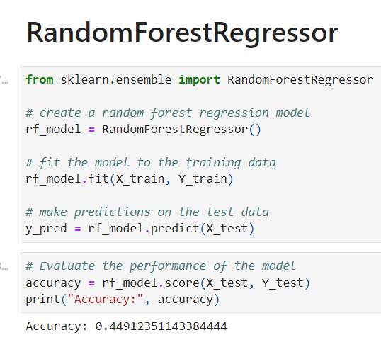
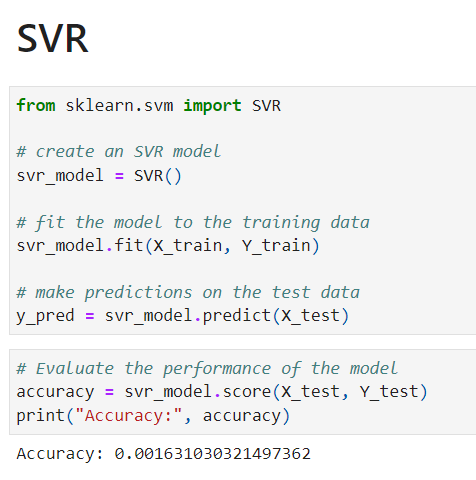
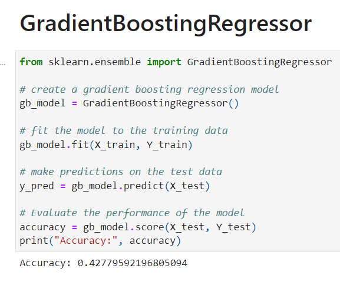
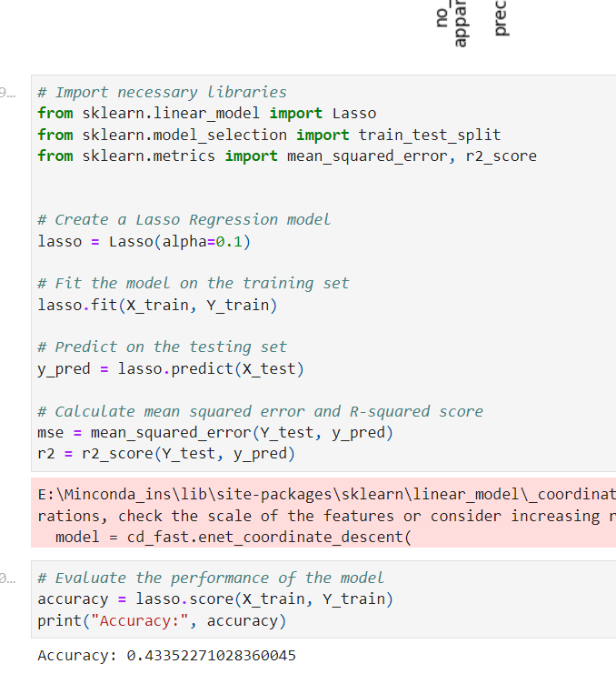

# Restaurant Sales Forecasting Project

## Introduction
This project aims to forecast the sales of a restaurant using various machine learning techniques. The dataset used in this project contains everyday sales data from 2017 to 2019. In addition to this, weather data for the city where the restaurant is located was also incorporated.

## Data Visualization
The project started with visualizing the inside and outside sales graph.
Which means the sales that took place inside the restaurant and outside the restaurant like small snacks items and sweets.

## Time Series Visualization
The time series visualization section details the process of using ARIMA and SARIMA models to predict sales. The models were trained on the 2017 and 2018 data, and the aim was to predict sales for 2019. The predicted sales and actual sales were then plotted for both models.
### Sales Graph
In this section, a graph was plotted to visualize the overall monthly sales.

### ARIMA

<table>
  <tr>
    <td>
      <figure>
        
        <figcaption>2019 Actual Sales</figcaption>
      </figure>
    </td>
    <td>
      <figure>
        
        <figcaption>2019 Sales Forecast</figcaption>
      </figure>
    </td>
  </tr>
</table>

### SARIMA

<table>
  <tr>
    <td>
      <figure>
        
        <figcaption>2019 Actual Sales</figcaption>
      </figure>
    </td>
    <td>
      <figure>
        
        <figcaption>2019 Sales Forecast</figcaption>
      </figure>
    </td>
  </tr>
</table>

## Neural Networks

### Trained Everyday sales

In the next step, a neural network was built to forecast sales. The model was first trained on everyday sales, and then on monthly sales by aggregating the data.

### Trained Every Month sales

The model was first trained on monthly sales by aggregating the data.

## Multivariate Time Series Analysis(VAR model)
To improve the accuracy of the forecast, the weather data was merged with the sales data. 

## Machine Learning Models
Various machine learning models were then used to predict sales. Linear Regression, Decision Tree Regression, Random Forest Regression, SVR, Gradient Boosting Regression, and Lasso Regression models were all tested. However, the results were not satisfactory.

| Column 1 | Column 2 |
| --------| --------|
|  |  |
|  |  |
|  |  |

## Stacked Classifier Model
Finally using only the important featuresa a model was built using a stacked classifier with Decision Tree Regression, Random Forest Regression, and Gradient Boosting Regression. This model produced a low MSE score, indicating its success in predicting sales.

## Conclusion
This project demonstrates the use of various machine learning techniques to forecast restaurant sales. The models used in this project could be extended and adapted to improve sales forecasts for other restaurants as well.

The code and documentation for this project can be found in the Github repository.
